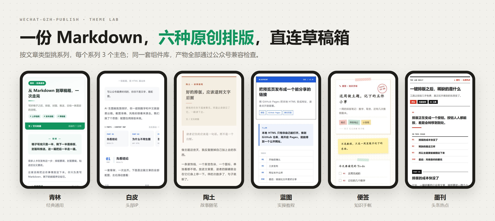
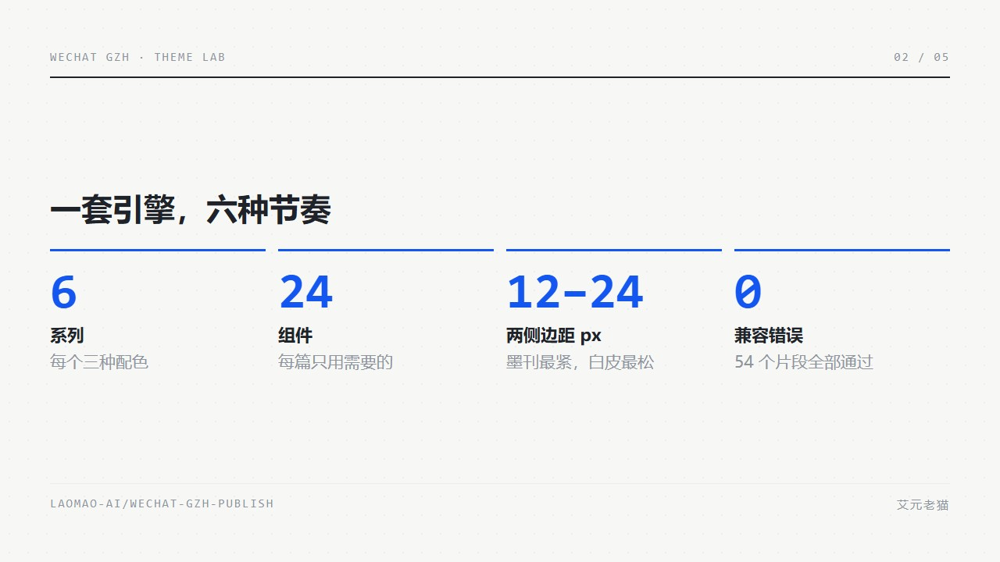
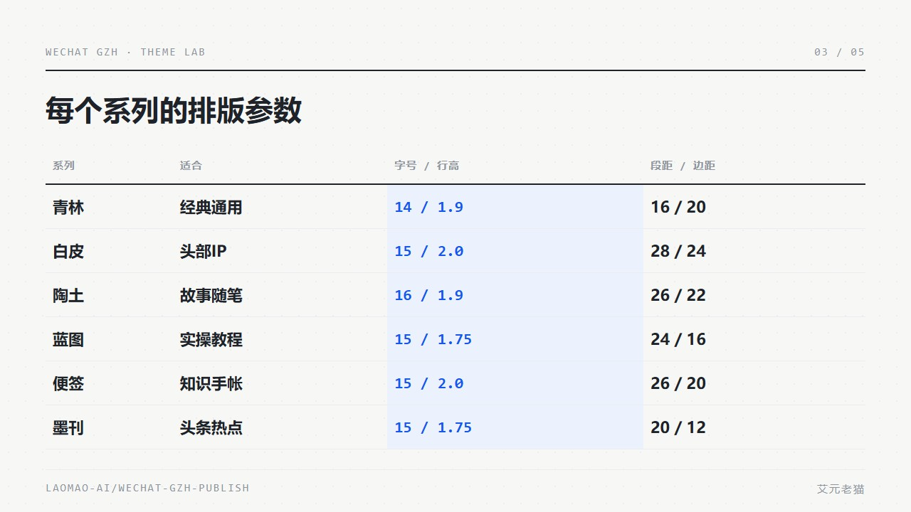

# wechat-gzh-publish



**一份 Markdown，六种原创排版，直连公众号草稿箱。** 本地直连微信官方 API，文章不经过任何第三方服务器。

[在线挑主题](https://laomao-ai.github.io/wechat-gzh-publish/theme-lab/) · [安装](#快速开始) · [六个系列](#六个系列按文章类型选) · [插图卡](#插图卡配图也用排版来做) · [致谢](#致谢)

```
质检 → 排版（六选一，校验 0 WARN）→ 配图（插图卡 / 生图）→ 直连草稿箱 → 人工点「发表」
```

## 六个系列，按文章类型选

不按颜色选，按这篇文章想给读者什么节奏选。每个系列 3 个主色，共用一套组件库，产物全部通过公众号兼容检查。

| 系列 | 用途 | 适合写什么 | 一句话风格 |
|---|---|---|---|
| **青林** | 经典通用 | 综合长文、产品发布、开源介绍、复盘 | 白底一抹活绿，组件多但同一套圆角与间距 |
| **白皮** | 头部IP | AI 工具实测、产品速览、图文简报 | 像技术白皮书：横滑目录、PART 章节头、CASE / PROMPT 标签 |
| **陶土** | 故事随笔 | 品牌故事、个人随笔、观点长文 | 暖色纸面，衬线标题承担情绪 |
| **蓝图** | 实操教程 | 教程、评测、操作指南 | 零圆角零阴影，信息靠线和格子分层 |
| **便签** | 知识手帐 | 学习笔记、清单、方法论 | 点阵纸、胶带、印章负责气氛，正文依旧好读 |
| **墨刊** | 头条热点 | 行业评论、热点解读、周报 | 黑白九成，一种信号色只做刊头与引语 |

打开[在线主题实验室](https://laomao-ai.github.io/wechat-gzh-publish/theme-lab/)可以切换系列、主色和三种预览，点「复制到公众号」直接粘进编辑器。本地打开 `theme-lab/index.html` 效果一样。

<p align="center"></p>

## 快速开始

```bash
# 1. 拉取（放到你 Agent 的 skills 目录，见 SKILL.md）
git clone https://github.com/laomao-ai/wechat-gzh-publish.git && cd wechat-gzh-publish

# 2. 微信凭证（AppSecret 不回显）+ 体检，体检会告诉你 IP 白名单填哪个
python scripts/init_credentials.py
python scripts/wechat_draft.py doctor

# 3. 排版 → 检查 → 推送
python theme-lab/engine/render.py article.md forest-leaf --out out/
python theme-lab/engine/check.py out/article.forest-leaf.gzh.html      # 须 ERROR=0 WARN=0
python scripts/wechat_draft.py push article.md --html out/article.forest-leaf.gzh.html --cover cover.jpg
```

排版引擎和推送脚本只用 Python 标准库。裁封面需要 `pip install pillow`；插图卡截图需要 `npm i playwright`，本机没有 Chrome 时再跑 `npx playwright install chromium`。AppID 在[公众号后台](https://mp.weixin.qq.com) 设置与开发 → 账号设置 → 注册信息；AppSecret 和 IP 白名单在[微信开发者平台](https://developers.weixin.qq.com/console/index?tab1=business&tab2=dataStore)（我的业务与服务 → 公众号 → 绑定 AppID）。体检缺凭证时会打印完整步骤。完整配置见 [docs/CONFIG.md](docs/CONFIG.md)。

在 Agent 里更简单：「用青林排这篇，推到草稿箱」。

## 写法：照常写 Markdown

| 写法 | 效果 |
|---|---|
| `## 01　标题 ｜ KICKER` | 章节头 + 英文眉标 |
| `### CASE 01 · 标题` | 带标签的小标题（STEP 同理） |
| `` | 题图 / 无框 / 窗口框 |
| `:::gallery swipe … :::` | 多图：并排、拼长图、左右滑动、窗口框 |
| `> [!TIP]` `> [!KEY]` `> [!ASK]` | 提示卡 / 划重点 / 结尾互动 |
| ```` ```prompt 标题 ```` | 提示词框，自动编号 |

全部组件及写法见 [`theme-lab/showcase.md`](theme-lab/showcase.md)。

## 插图卡：配图也用排版来做

AI 生图画氛围很好，但一碰到数字和中文就容易出错。插图卡用 HTML 画、再截成图，配色跟随文章主题。

<p align="center">


</p>

- 五种骨架：标题封面、数据、对比、引语、步骤
- 四种比例：16:9 正文图、3:4 竖图、**2.35:1 公众号头图 + 1:1 方图**
- 截图前自动实测：元素越界直接报错，正文字太小给提醒

| 模式 | 适合 | 需要配置 |
|---|---|---|
| **A 代码渲染**（默认） | 标题封面、数据、对比、步骤、引语 | 无 |
| **B 生图模型** | 氛围图、插画、场景图 | 一个 API key（Gemini / OpenAI / 火山方舟 / 任意 OpenAI 兼容中转） |

两者可以组合：B 出不带字的底图，A 把标题叠上去。

## 另外两个我自己最需要的能力

**改稿不堆重复稿。** 同一篇文章用固定 slug（front matter 的 `id` 或文件路径）记在本地，再推走 `draft/update`，改标题、改摘要都不会另起一篇。

**出口 IP 双源探测。** 有代理时境外查询站返回的是代理节点 IP，微信看到的是你的真实宽带出口。`doctor` 同时探测境内外并提示该填哪个。最准的办法是直接看微信报错里的 IP。

## 已知限制

| 限制 | 说明 |
|---|---|
| 「自动发表」做不到 | 2025-07 起个人主体 / 未认证账号的 `freepublish` 接口被回收，终点是草稿箱，发表要人工点 |
| 动态 IP 需重配 | 家用宽带出口 IP 会变，长期方案是部署到固定 IP 的机器 |
| 左右滑动 | 依赖公众号对滚动样式的支持，发表前请在手机预览确认 |
| AI 生成标识 | `fit_cover.py` 默认不裁「AI 生成」标识；发表时记得勾选 AI 内容声明 |

## 仓库里有什么

```
wechat-gzh-publish/
├── SKILL.md              ← Agent 使用说明（质检 → 排版 → 配图 → 推送）
├── theme-lab/            ← 六个原创主题 + 插图卡
│   ├── index.html        ← 主题实验室（可放 GitHub Pages）
│   ├── engine/           ← render / check / cards / lint，纯标准库
│   ├── samples/          ← 每个系列一篇样例
│   └── CREDITS.md        ← 思路来源与致谢
├── scripts/              ← wechat_draft.py（草稿箱直连）/ gen_image.py / fit_cover.py
├── references/           ← 质检框架、标题优化
├── docs/                 ← 配置指南、踩坑记录
└── config/               ← 主题注册表、凭证与生图配置模板
```

## 致谢

这些项目给了我们思路，我们只借鉴做法，**代码、样式、配色和素材都是原创**，没有复制任何源文件：

- 归藏（[op7418](https://github.com/op7418)）的 guizang-ppt-skill、guizang-social-card-skill、guizang-product-video-skill：插图卡骨架、头图与方图成对出、渲染后实测校验
- 甲木（[isjiamu](https://github.com/isjiamu)）的 [gzh-design-skill](https://github.com/isjiamu/gzh-design-skill) 与公众号文章：公众号兼容规则、青林沿用的摸鱼绿参数、白皮的横滑目录和章节头

逐条说明见 [theme-lab/CREDITS.md](theme-lab/CREDITS.md) 和 [THIRD_PARTY_NOTICES.md](THIRD_PARTY_NOTICES.md)。谢谢归藏师傅和甲木老师把好东西开源出来。如果你发现哪里和原项目过于相似，欢迎提 issue。

## License

MIT（见 [LICENSE](LICENSE)）。备选排版层 `vendor-gzh` 来自 gzh-design-skill（AGPL-3.0），独立 clone 使用，不随本仓库分发。
