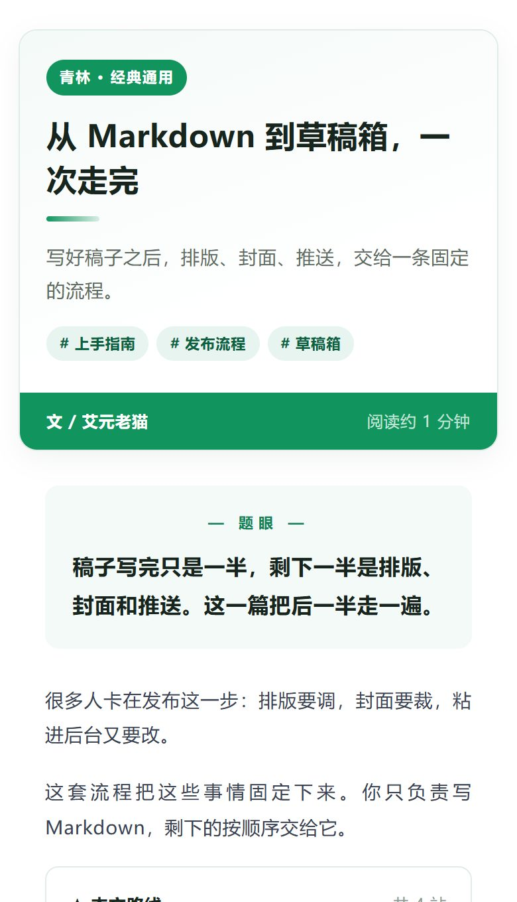
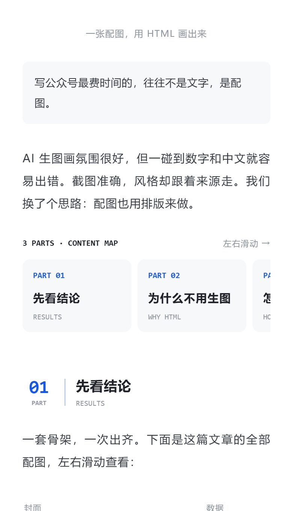
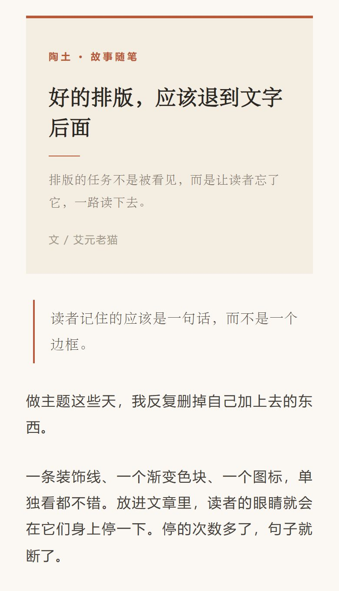
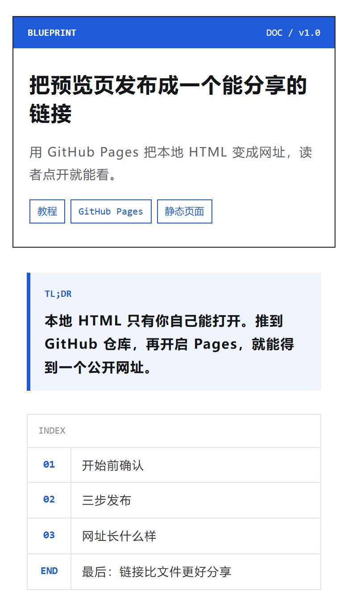
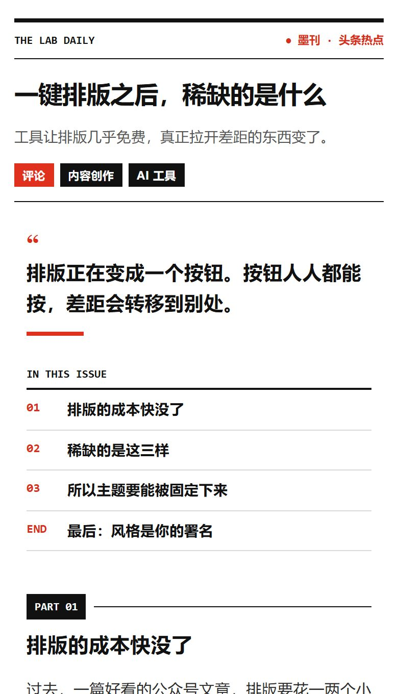
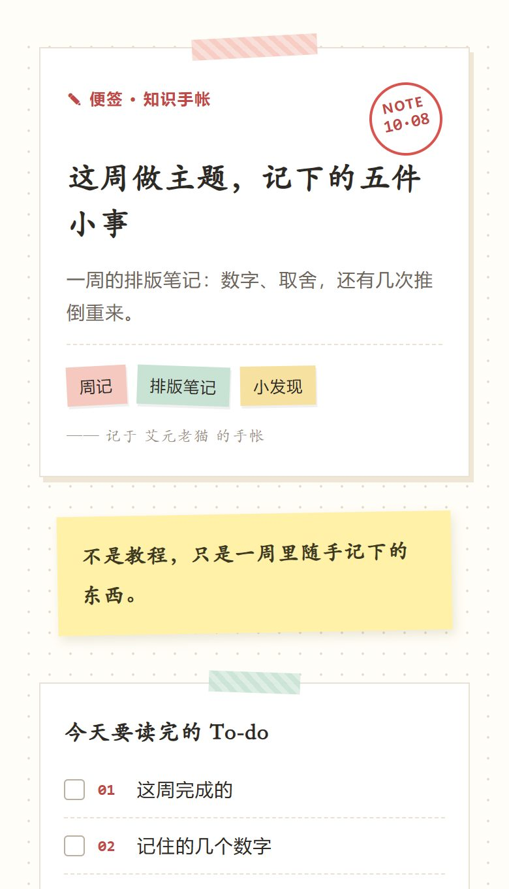
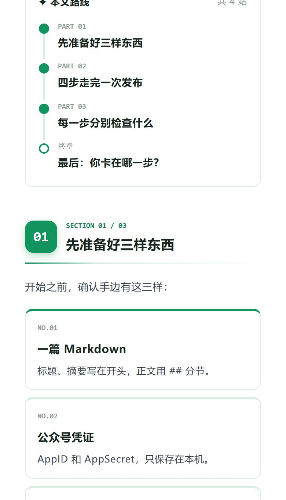
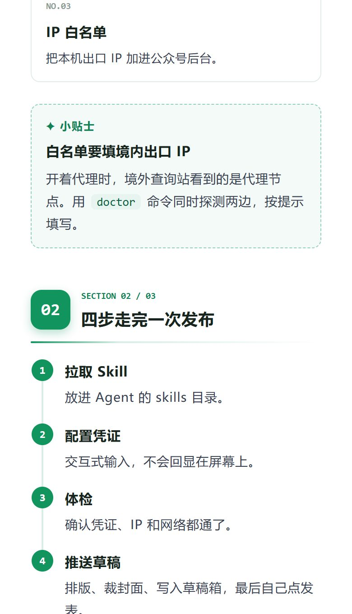
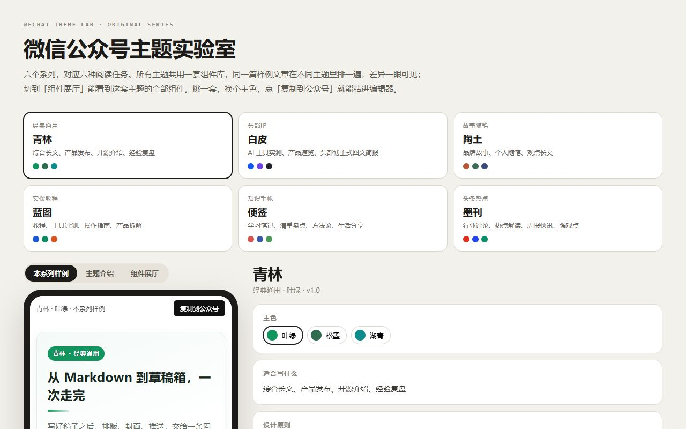

# 组件展厅：这套主题能做什么

> 这一页不是文章，是一张组件清单：每个样式出现一次，写法就在旁边。

正文段落长这样。句子里可以有**加粗强调**，可以有==荧光高亮的半句话==，也可以写 `build.py` 这样的行内代码。

## 01　标题与强调

### 这是小节标题

小节标题用来在一章里再分一层，比章节轻，比加粗重。

**整段加粗会变成「划重点」卡，用来放一节的结论。**

> 好的排版，是让读者忘记排版的存在。
> —— 引语可以带出处

*整段斜体是注释，适合放补充说明或免责声明。*

## 02　提示与清单

> [!TIP] 先用样例试排
> 提示卡：给读者一个省事的办法。

> [!NOTE] 图片要先传到公众号
> 说明卡：不影响主线，但值得知道。

> [!WARN] 别在预览页里改稿
> 注意卡：读者容易踩坑的地方，提前说。

> [!KEY] 一节只留一个结论
> 关键卡：这一节最想让人带走的一句话。

- 普通列表的一项
- 普通列表的另一项

- [x] 已经完成的检查项
- [ ] 还没做的检查项

## 03　步骤、卡片与表格

1. **准备稿子**：写好 Markdown，或者直接用样例。
2. **挑选主题**：在实验室里切换系列与主色。
3. **复制发布**：一键复制，粘贴到公众号编辑器。

:::cards
- **方案 A**：适合已经有稿子的人，直接排版。
- **方案 B**：适合从零开始的人，先用样例练手。
:::

| 组件 | Markdown 写法 |
| --- | --- |
| 提示卡 | > [!TIP] 标题 |
| 步骤条 | 1. **步骤**：说明 |
| 清单 | - [x] 事项 |

## 04　代码与单图

```bash
# 生成全部预览
python engine/build.py
python engine/check.py themes/*.fragment.html
```



## 05　多图排版

### 并排对比

:::gallery row 两张并排，适合前后对比


:::

:::gallery row 三张并排，适合一组同类截图



:::

### 左右滑动

:::gallery swipe 多张截图放一行，读者自己滑



:::

### 纵向拼接

:::gallery stack 两张截图无缝拼成一张长图


:::

### 上下滑动

:::gallery scroll 长截图放进固定高度的窗口


:::

### 窗口边框

:::gallery frame 给截图加一个浏览器窗口外框

:::


***

## 最后：组件不是越多越好

每个组件都对应一个具体的阅读任务。用得上就用，用不上就留在展厅里。

> [!ASK] 你最常用的是哪一个组件？
